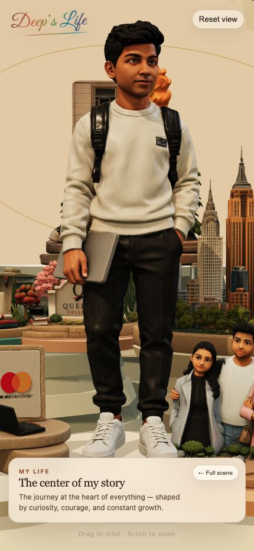
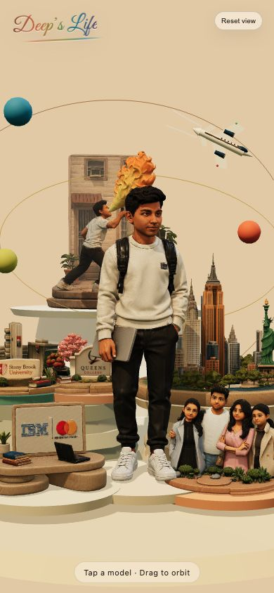
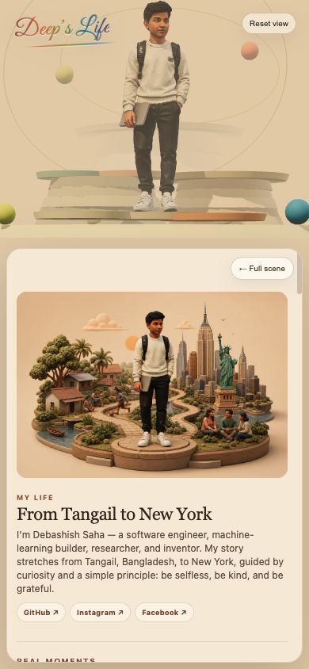
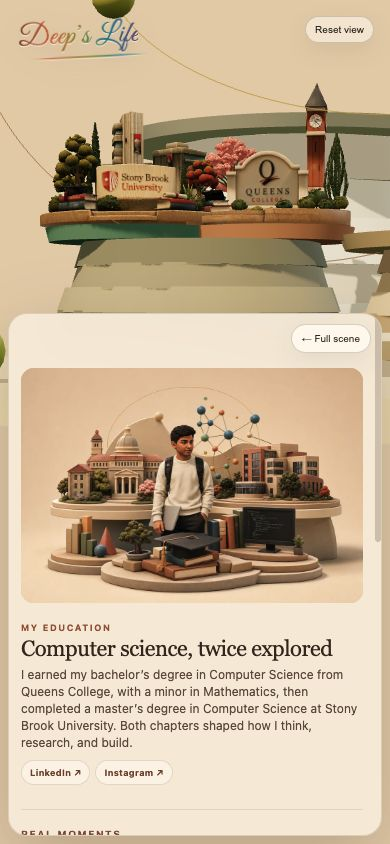
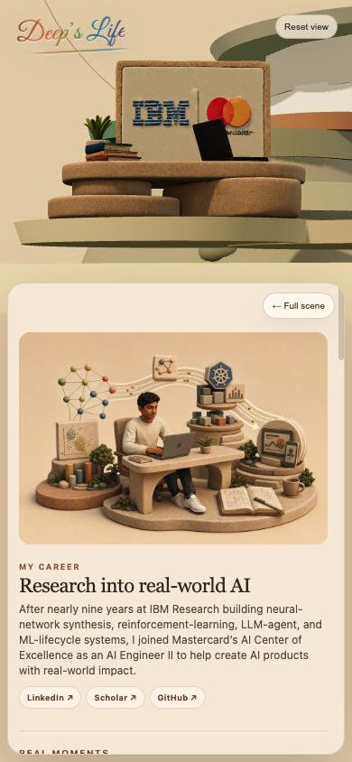

<div align="center">

# Deep's Life

### An interactive 3D story told through the people, places, and passions that shaped me.

[](https://deepsaha.com)

</div>



## About the experience

**Deep's Life** is a handcrafted, portrait-first 3D autobiographical diorama. A central traveler stands among the pieces of his story: New York City, two university campuses, family, career, travel, and a fire-breathing performance that represents creativity and passion.

The composition was assembled from individual GLB models and staged as one warm, illustrated world inspired by a sculpted paper-and-stone diorama.

## A closer look

<div align="center">
  <table>
    <tr>
      <td align="center">
        <br>
        <sub><b>Portrait overview</b></sub>
      </td>
      <td align="center">
        <br>
        <sub><b>My Life</b></sub>
      </td>
      <td align="center">
        <br>
        <sub><b>My Education</b></sub>
      </td>
      <td align="center">
        <br>
        <sub><b>My Career</b></sub>
      </td>
    </tr>
  </table>
</div>

Each object opens a vertically scrollable chapter with personal photographs, milestones, research, patents, and links to the original work. The focus camera adapts to the available screen space so the selected 3D subject remains visible above the story on both desktop and mobile.

## Highlights

- **Interactive storytelling** — hover over a model to discover its chapter.
- **Click-to-focus camera** — select an object to bring it forward and reveal its story.
- **Responsive focus framing** — each selected subject is fitted above its story card on portrait and desktop screens.
- **Living story chapters** — vertically scroll through personal photographs, accomplishments, research, patents, and videos.
- **Slow cinematic rotation** — the diorama gently turns when left untouched.
- **Hand-staged 3D scene** — custom lighting, orbit paths, planets, sandstone platforms, and layered terraces.
- **Personal story worlds** — life, career, education, family, city, passion, and travel.
- **No framework or build step** — the entire experience runs with HTML, CSS, JavaScript, and Three.js.

## Story chapters

| Scene | Chapter | Meaning |
| --- | --- | --- |
| Central traveler | **My Life** | The journey at the heart of the composition |
| Stone desk and laptop | **My Career** | Work, ideas, tools, and ambition |
| University campuses | **My Education** | The communities that shaped how I learn and build |
| Family sculpture | **My Family** | Support, connection, and shared strength |
| New York skyline | **My City** | Energy, opportunity, and home |
| Fire-breathing performer | **My Passion** | Creativity, courage, and taking risks |
| Airplane and orbit | **My Journey** | New perspectives and possibilities |

## Controls

| Action | Desktop | Mobile |
| --- | --- | --- |
| Explore a chapter | Hover over a model | Tap a model |
| Focus on a chapter | Click a model | Tap a model |
| Rotate the diorama | Click and drag | Drag |
| Zoom | Scroll | Pinch |
| Return to the composition | Select **Full scene** or **Reset view** | Select **Full scene** or **Reset view** |

## Built with

- [Three.js](https://threejs.org/) for real-time 3D rendering
- `GLTFLoader` and `MeshoptDecoder` for compressed GLB models
- `OrbitControls` for camera interaction and ambient rotation
- Vanilla JavaScript for scene construction, raycasting, and camera animation
- Responsive CSS for the portrait interface and story panels
- Netlify for static hosting and custom-domain delivery

## Run locally

No package installation or build command is required. From the project directory, start a local web server:

```bash
python3 -m http.server 8000
```

Then open [http://localhost:8000](http://localhost:8000).

> Three.js is imported from jsDelivr, so the first load requires an internet connection.

## Project structure

```text
.
├── index.html           # Page structure and Three.js import map
├── styles.css           # Responsive interface and story-card styling
├── app.js               # Scene, models, lighting, interactions, and animation
├── preview.png          # Project preview used by this README
├── assets/
│   ├── chapters/        # Illustrated chapter covers
│   ├── photos/          # Personal story photographs
│   ├── readme/          # Compact README previews
│   └── *.glb            # Original and optimized 3D models
└── tools/
    └── inspect-glb.mjs  # Small utility for inspecting GLB scene contents
```

## Deployment

Because this is a static website, it can be deployed directly to Netlify, Vercel, GitHub Pages, or any conventional web host. Upload the project with `index.html` at the root and preserve the `assets/` directory.

The live version is available at **[deepsaha.com](https://deepsaha.com)**.

## Performance

The live scene loads Meshopt-compressed versions of all seven active GLB models. Their combined payload is approximately **6.9 MiB**, reduced from roughly **50.4 MiB** for the original files—about an **86% reduction**. The original models remain in the repository as source assets, while the website uses the `.optimized.glb` files for faster mobile loading.

## Creator

Designed and assembled by **Deep Saha** as an interactive portrait of life, learning, family, work, and creative ambition.

---

<div align="center">
  <sub>Made with curiosity, courage, and a little bit of fire.</sub>
</div>
